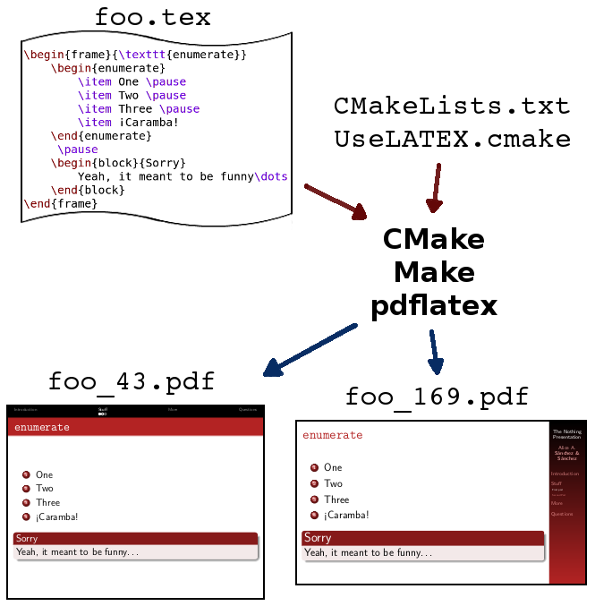

# TheNothingPresentation
Presentation prototype using beamer and `UseLATEX.cmake` to target both 4:3 and 16:9 aspect ratios

In order to use TheNothingPresentation, you will also need to download `UseLATEX.cmake`, which you can get in:

+ https://cmake.org/Wiki/CMakeUserUseLATEX
+ https://github.com/kmorel/UseLATEX
